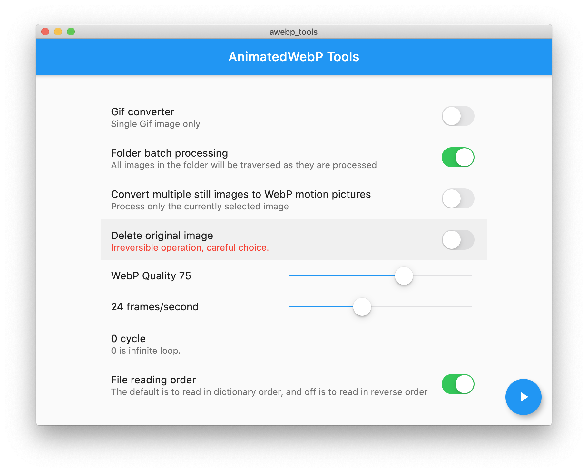

  
# iToolsBox

A desktop animated webp tools, to help generate animated webp from Gif or sequence images.

## Screenshot

## Downloads 💎
Download the latest from [page](https://github.com/TinoGuo/iToolsBox/releases)

## TODO

### Operating System Support    

- [X] MacOS   
- [ ] Windows   
- [ ] Linux   

### Functionality   

- [X] Gif2Webp   
- [X] Single Webp   
- [X] Directory input   
- [X] Multi File input   
- [X] Quality adjust   
- [ ] Batch Gif process   
- [ ] Pattern input️   
- [ ] Drag file input   

### Improvement   

- [ ] Layout optimization   
- [ ] Process optimization  
- [X] Translation

