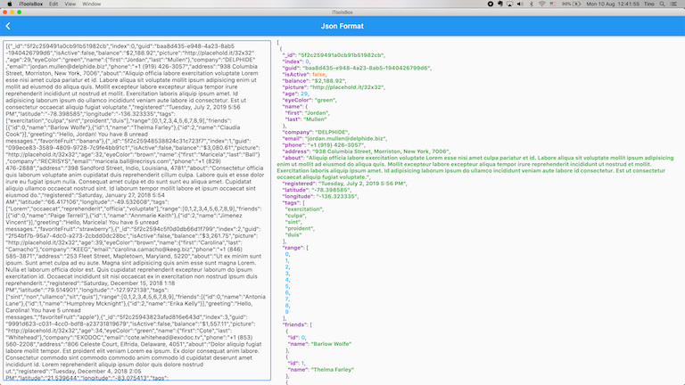

  
# iToolsBox

Desktop development tool box, provided all in one app.

1. A desktop animated webp tools, to help generate animated webp from Gif or sequence images.
2. Format json and highlight json data

## Screenshot

## Downloads 💎
Download the latest from [page](https://github.com/TinoGuo/iToolsBox/releases)

## TODO

1. webpConverter
   1. Operating System Support    
      - [X] MacOS   
      - [ ] Windows   
      - [ ] Linux
   2. Features
      - [X] Gif2Webp   
      - [X] Single Webp   
      - [X] Directory input   
      - [X] Multi File input   
      - [X] Quality adjust   
      - [ ] Batch Gif process   
      - [ ] Pattern input️   
      - [ ] Drag file input  
   3. Improvement
      - [ ] Layout optimization   
      - [ ] Process optimization  
      - [X] Translation
2. JsonFormatter
   1. Operating System Support
      - [X] MacOS
      - [X] Windows
      - [X] Linux
   2. Features
      - [X] Format json
      - [X] Hightlight
      - [X] Error syntax
      - [ ] Line number
      - [ ] Compress
      - [ ] Intent optional